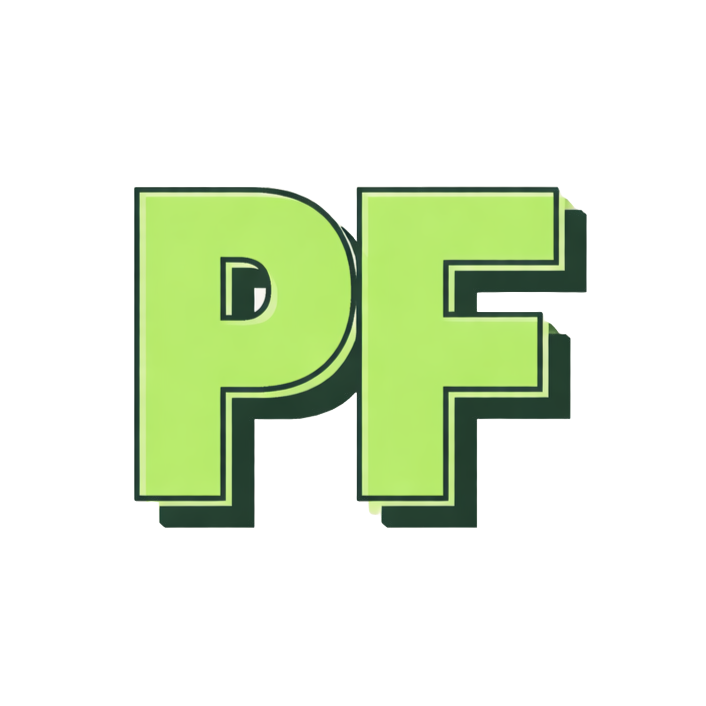

  

<h1 align="center">Pat</h1>

  Software Developer in Progress | Future DevOps Engineer

---

## About

🎓 Certificate III in Information Technology  

After relying too heavily on AI tools over the past two years, I made the decision to rebuild my knowledge properly — focusing on deep understanding, independent problem-solving, and strong engineering fundamentals.

My goal is to work in Software Development and become a Microsoft Certified DevOps Engineer, building reliable systems and automated workflows in the Microsoft ecosystem.

---

## What I'm Learning

### Languages

  
  
  

- Writing clean, structured C# code  
- Rebuilding Python fundamentals  
- Using PowerShell for scripting and automation  

---

### Development & Workflow

  
  

- Version control best practices  
- Branching strategies  
- Commit discipline  
- Understanding CI/CD foundations  

---

### Core Foundations

- Object-Oriented Programming (OOP)  
- Data Structures & Algorithms  
- Debugging without over-reliance on AI  
- Writing code I fully understand  

---

## Direction

Software Development  
DevOps Engineering  
CI/CD & Automation  
Azure & Cloud Infrastructure  

---

## Wise words

Real Men Test in Prod

---
